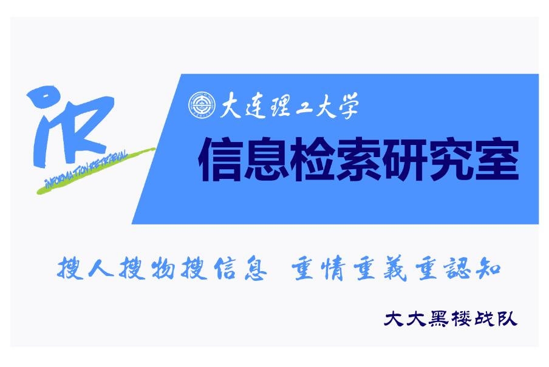

## 2016CCF [大数据精准营销中搜狗用户画像挖掘](http://www.wid.org.cn/data/science/player/competition/detail/description/239)  final winner solution

李恒超、[李裕礞](https://github.com/liyumeng)、王安然、钱凌飞、任璐

大连理工大学信息检索实验室

赛题描述
=====
[大数据精准营销中搜狗用户画像挖掘 赛题描述](https://github.com/liyumeng/ccf2016_sougou/wiki/%E5%A4%A7%E6%95%B0%E6%8D%AE%E7%B2%BE%E5%87%86%E8%90%A5%E9%94%80%E4%B8%AD%E6%90%9C%E7%8B%97%E7%94%A8%E6%88%B7%E7%94%BB%E5%83%8F%E6%8C%96%E6%8E%98-%E8%B5%9B%E9%A2%98%E6%8F%8F%E8%BF%B0)

重现实验
========
把原始数据　user_tag_query.10W.TRAIN　和　user_tag_query.10W.TEST 放在`./data/`目录下，然后运行`run.sh`
最后能生成　tfidf_dm_dbow_20W.csv,为方便大家阅读，代码已整理成最简洁的形式，该结果B榜成绩会在**0.724**左右。
建议在**ubuntu**环境下运行，windows环境下，也可以运行run_cv.ipynb

数据下载
=========
https://pan.baidu.com/s/1bpGIfxX
提取码：kcnm

依赖
=======
* Anaconda 4.2.0(Python 3.5 version)
* jieba 0.38
* keras 1.1.0
* xgboost 0.6
* gensim 0.13.2

平台
============
**ubuntu 16.04**

硬件
=======
本代码是在8core,i7CPU,8gb RAM 的电脑上开发的.总共运行时间大概需要5个小时

其他
=======
如果觉得不错的话，欢迎大家点击右上角的star和fork,谢谢！

[算法说明文档下载](docs/搜狗用户画像竞赛_算法说明文档.docx)

我们参加的其他竞赛：

[2nd Place Solution for SMP CUP 2016](https://github.com/liyumeng/SmpCup2016)

[1st Place Solution for 2016CCF大数据竞赛客户画像赛题(用户画像)](https://github.com/feidapeng/2016CCF_StateGrid_UserProfile)

[Tsinghua Data Science Winter School 2017 Link Prediction](https://github.com/liyumeng/LinkPrediction)

